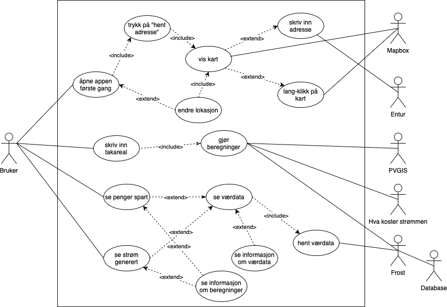
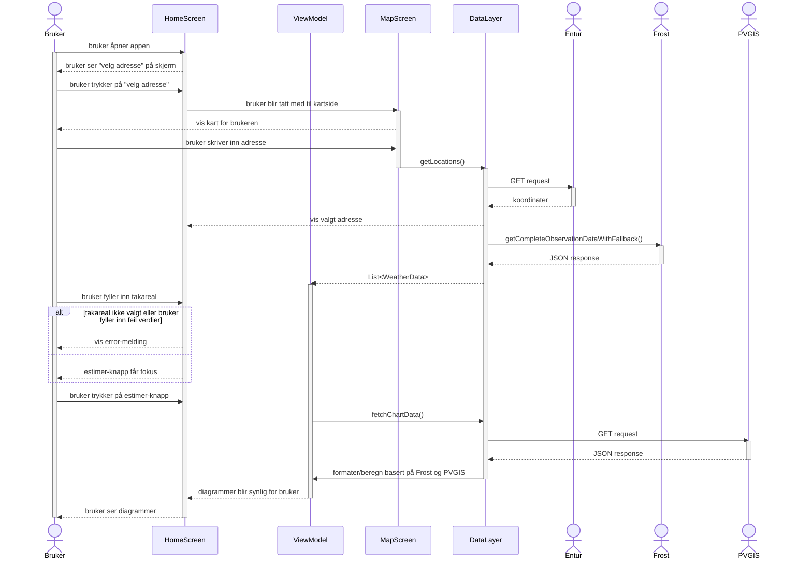
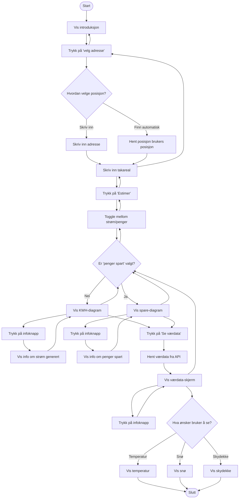
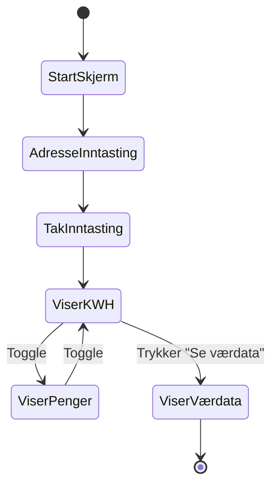

# team-15

# Begrunnelse for valg av diagram

Vi har valgt å bruke ulike UML- og modelleringsteknikker for å gi et helhetlig bilde av appen og dens funksjonalitet fra forskjellige perspektiver:  

Use-case diagrammet gir en oversikt over hvordan brukeren interagerer med systemet og hvilke hovedfunksjoner som finnes i appen. Det hjelper å identifisere de viktigste funksjonelle kravene.

Sekvensdiagrammet viser samspillet mellom bruker, app og eksterne systemer (API-er) over tid. Det konkretiserer rekkefølgen og logikken i et typisk brukerscenario.

Aktivitetsdiagram brukes for å visualisere den dynamiske flyten i systemet, f.eks. hvordan en bruker beveger seg gjennom appen.

Tilstandsdiagram er nyttig for å vise hvordan en komponent (eller skjerm) endrer tilstand basert på brukerhandlinger eller innkommende data.

Klassediagram brukes til å vise hvordan appen er bygd opp. Den illustrerer objekter i appen, deres attributter og metoder, og assosiasjonene mellom dem. 

# Viktigste funksjonelle krav

1. Brukeren kan skrive inn adresse, flytte pin'en for å velge nøyaktig lokasjon, samt benytte seg av "Min posisjon"-funksjonen
2. Appen viser beregnet kWh-produksjon og eventuelle besparelser
3. Brukeren kan se værdata
4. Systemet henter automatisk data fra vær-API og benytter seg av geolokasjon dersom "Min posisjon" brukes


# Use-case diagram - brukerinteraksjon med Sunalytics


# Tekstlig beskrivelse av de viktigste use-casene 


## Skriv inn adresse
Aktør: Bruker  
Beskrivelse: Brukeren skriver inn en adresse for å hente solinnstrålingsdata og tilpasse beregningene. Adressen lagres i appens tilstand.  
Forventet respons: Systemet lagrer adressen og viser neste steg.

## Skriv inn takareal
Aktør: Bruker  
Beskrivelse: Brukeren legger inn størrelsen på sitt tak. Dette er grunnlaget for å beregne forventet strømproduksjon.  
Forventet respons: Systemet viser diagram med estimert strømproduksjon (KWH).  

## Se KWH / penger spart
Aktør: Bruker  
Beskrivelse: Etter å ha lagt inn adresse og areal, får brukeren vist hvor mye strøm solcellene potensielt kan produsere, og hvor mye penger dette tilsvarer.  
Forventet respons: Systemet viser linjediagram med valgt datavisning.  

## Se værdata
Aktør: Bruker  
Beskrivelse: Brukeren kan trykke for å se værforhold. Systemet henter sanntidsdata fra vær-API.  
Forventet respons: Appen viser temperatur, snødybde og skydekke i diagramform.  


# Sekvensdiagram - Sekvensiell bruk av Sunalytics


Med mål om å holde sekvensdiagrammet kort og konsist, har vi modellert en brukerinteraksjon fra startskjerm, til og med det første diagrammet er lastet inn og synlig for bruker.
Den illustrerte interaksjonen berører alle lag i applikasjonen og viser en typisk sekvensiell flyt, uten at det blir overflødig. 


# Aktivitetsdiagram


# Tilstandsdiagram 


# Klassediagrammer
## Klassediagram med utgangspunkt i HomeViewModel
```mermaid

classDiagram
direction TB

class HomeViewModel {
			private val solarRepository: SolarRepository
			private val priceRepository: PriceRepository
			private val _solarDataPvgisUiState
			val solarDataPvgisUiState: StateFlow
			private val _solarDataFrostUiState
			val solarDataFrostUiState: StateFlow
			private var _weatherUiState
			val weatherUiState: StateFlow
			fun fetchChartData(lat: Double, lon: Double)
			fun fetchStationAndData(lat: String, lon: String)
			private fun fetchWeatherData(lat: String,lon: String,stationName: String,)
		}
		class SolarRepository {
			private val solarDatasource: SolarDataSource
			private val weatherDataSource: WeatherDataSource
			private val interval : String
			private val monthString : List
			suspend fun getMonthlySolarProduction(lat: Double, lon: Double, roofArea: Double) List&gt;
			suspend fun calculateMonthlySolarProduction(lat: Double, lon: Double, weatherData: List, roofArea: String) List&gt;
			suspend fun getCompleteObservationDataWithFallback(lat: String,lon: String) List
		}
		class SolarDataSource {
			private val ktorHttpClient: HttpClient
			private val baseUrl: String
			suspend fun fetchSolarData(lat: Double, lon: Double, roofArea: Double) PvgisResponse?
			suspend fun fetchRadiationData(lat: Double, lon: Double) RadiationResponse?
		}
		class PvgisResponse {
			val outputs: Outputs
		}
		class Outputs {
			val monthly: Monthly
			val totals: Totals
		}
		class RadiationResponse {
			val outputs: RadiationOutputs
		}
		class RadiationOutputs {
			val monthly: List
		}
		class MonthlyData {
			val year: Int
			val month: Int
			val irradiation: Double
		}
		class WeatherDataSource {
			private val ktorHttpClient: HttpClient
			private val weatherDao : WeatherDao
			private val sourceURL : String
			private val observationURL  : String
			suspend fun fetchSourceData(lat: String, lon: String, time: String, interval : String) SourceResponse?
			suspend fun fetchObservationData(time: String, where: String, interval : String) FrostResponse?
			suspend fun getAllRowsWithThisVariable(column : String, columnString : String) List
			suspend fun deleteOldStationData(column : String, columnString : String)
		}
		class AppDatabase {
			val stationID: String
			val timeReference: String
			val airTemperature: Double?
			val snow: Double?
			val cloud: Double?
			fun doesDataExist(query: SupportSQLiteQuery) Boolean
			fun getDataRows(query: SupportSQLiteQuery) List
			fun getTimeOfFetch(query: SupportSQLiteQuery) List
			fun deleteOldDataWithCoordinate(thisCoordinate : String)
			fun deleteOldDataWithStationID(thisStationID : String)
			fun insertNewObservationData(weatherData: WeatherData)
		}
		class SourceResponse {
			val data: List
		}
		class SData {
			val id: String
			val name: String
		}
		class FrostResponse {
			var data: List Data
		}
		class Data {
			val observations: List,
			val referenceTime: String,
		}
		class Observation {
			val elementId: String,
			var value: Double
		}
		class PriceRepository {
			private val priceDataSource: PriceDataSource
			suspend fun getPriceData(lat: Double, lon: Double) : List&gt;
			private fun filterTimeStamp(timeStamp: String) : Int
		}
		class PriceDataSource {
			private val ktorHttpClient: HttpClient
			private val baseUrl: String
			private val endpoint: String
			private val outputFormat: String
			suspend fun fetchPriceData(lat: Double, lon: Double) : List
			private fun estimatePriceZone(lat: Double, lon: Double) : String
		}
		class PriceResponse {
			val nokPerKwh: Double
			val timeStart: String
		}

    HomeViewModel -- SolarRepository
    SolarRepository -- WeatherDataSource
    SolarRepository -- SolarDataSource
    SolarDataSource -- "0..1" PvgisResponse
    PvgisResponse -- "1..*" Outputs
    SolarDataSource -- "0..1" RadiationResponse
    RadiationResponse -- "1..*" RadiationOutputs
    RadiationOutputs -- "1..*" MonthlyData
    WeatherDataSource -- AppDatabase
    WeatherDataSource -- "0..1" SourceResponse
    WeatherDataSource -- "0..1" FrostResponse
    SourceResponse -- "1..1" SData
    FrostResponse -- "0..1" Data
    Data -- "1..*" Observation
    HomeViewModel -- PriceRepository
    PriceRepository -- PriceDataSource
    PriceDataSource -- "0..1" PriceResponse

 ```

## Klassediagram med utgangspunkt i MapViewModel
```mermaid

classDiagram
direction TB

    class MapViewModel {
			private val geocodingRepository: GeocodingRepository
			var location: Location?
			val mapViewportState
			var locationResults: List
			fun setLocation(location: Location,moveToOnMap: Boolean)
			private fun searchForLocations(onFinished:(List)
			fun updateToNearestLocation()
		}
		class GeocodingRepository {
			private val enturDataSource: EnturDataSource
			private val mapboxDataSource: MapboxDataSource
			fun getLocations(name: String, maxResults: Int = 5)
			suspend fun getNearestLocation(point: Point)
			private fun EnturResponse.toLocations()
			private fun MapboxResponse.toLocations()
		}
		class MapboxDataSource {
			private val ktorHttpClient: HttpClient
			private val baseUrl
			private val accessToken
			suspend fun geocodeReverse(point: Point, maxResults: Int = 5) : MapboxResponse?
		}
		class MapboxResponse {
			val features: List
		}
		class Feature-MapboxResponse {
			val properties: Properties
		}
		class Properties-MapboxResponse {
			val name: String
			val coordinates: Coordinates
			val placeFormatted: String
		}
		class Coordinates {
			val latitude: Double
			val longitude: Double
		}
		class EnturDataSource {
			private val ktorHttpClient: HttpClient
			private val baseUrl: String
			suspend fun geocodeAutocomplete(text: String, maxResults: Int) : EnturResponse?
		}
		class EnturResponse {
			val features: List
		}
		class Feature-EnturResponse {
			val geometry: Geometry
			val properties: Properties
		}
		class Geometry {
			val coordinates: List
			val type: String
		}
		class Properties-EnturResponse {
			val name: String
			val postalCode: String
			val municipality: String
		}
    
    MapViewModel -- GeocodingRepository
    GeocodingRepository -- MapboxDataSource
    MapboxDataSource -- "0..1" MapboxResponse
    MapboxResponse -- "0..1" Feature-MapboxResponse
    Feature-MapboxResponse -- "0..1" Properties-MapboxResponse
    Properties-MapboxResponse -- "0..1" Coordinates
    GeocodingRepository -- EnturDataSource
    EnturDataSource -- "0..1" EnturResponse
    EnturResponse -- "0..1" Feature-EnturResponse
    Feature-EnturResponse -- "0..1" Geometry
    Feature-EnturResponse -- "0..1" Properties-EnturResponse

```
